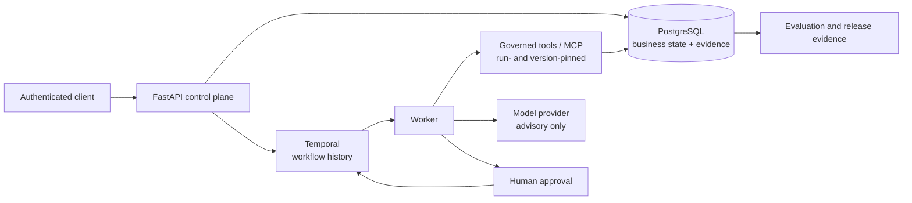

# Durable execution and governance for AI workflows

Agents Should Survive Failure is a production-style reference implementation for governed,
durable AI workflows. It demonstrates how Temporal, PostgreSQL, idempotent effects, and bounded
model and tool interfaces keep consequential workflows correct across retries and worker loss.
It is not a hosted platform or a compliance product.

> **Core invariant:** execution may happen more than once; business effect commits once.

## Why this project exists

AI workflow demonstrations usually stop at model output. Consequential workflows also need to
survive process loss, delayed approvals, repeated messages, network timeouts, and ambiguous
acknowledgements without duplicating business effects.

This repository makes those boundaries executable. Temporal owns workflow history and redelivery.
PostgreSQL owns business state, audit evidence, and idempotency constraints. Deterministic code
and an authorized human own decisions. Models provide bounded explanations but do not authorize
writes.

## Verified release evidence

- 171 unit tests, 21 integration tests, and 7 dedicated security tests.
- 24/24 reviewed production-workflow evaluation cases passed.
- Two reference workflows are proven on the same engine: vendor onboarding and high-value refund.
- `make test-worker-crash` kills a real Docker worker with `SIGKILL` and verifies one business
  projection and one synthetic notification after Temporal redelivery.
- Migration upgrade, downgrade, and re-upgrade are covered by the integration gate.
- Gitleaks, dependency audit, and backend, SDK, and container SBOM targets are included.

The integration gate writes bounded JSON and Markdown evidence to
[`artifacts/evaluations/`](artifacts/evaluations/). Historical release material is available in
the [v0.2.0 evidence summary](docs/evidence/v0.2.0.md), the [v0.2.0 release](https://github.com/kabbersokhi-boop/agents-should-survive-failure/releases/tag/v0.2.0),
and [GitHub Actions run 29545587083](https://github.com/kabbersokhi-boop/agents-should-survive-failure/actions/runs/29545587083).

## What the project is

The control plane is a FastAPI application backed by Temporal and PostgreSQL. It now has two
reference workflows that exercise the same start, approval, tool, persistence, and observability
contracts. The examples differ in domain data, evidence retrieval, risk rules, and projections;
the engine guarantees remain the same.

The public SDK and managed-agent runtime are separate preview surfaces. They demonstrate how a
trusted, operator-installed package can run in a Temporal activity with persisted checkpoints,
artifacts, budgets, events, and governed tools.

## Reference workflows

### Example 1: Vendor onboarding

The existing mature workflow reviews a supplier, retrieves policy evidence, calculates a
deterministic jurisdiction risk score, requests human approval, and persists an approved-vendor
projection and synthetic email. Tool grants are scoped to the run and tool versions are pinned.

### Example 2: High-value refund

The new refund workflow retrieves order and refund-policy evidence through governed tools,
calculates a deterministic refund risk score, records a bounded model explanation, waits for
human approval through the API, and commits an idempotent refund projection and notification.

| Engine guarantee | Vendor | Refund |
| --- | --- | --- |
| Durable Temporal execution and approval wait | Supplier review | Refund review |
| Deterministic risk calculation | Jurisdiction score | Amount and order-state score |
| Governed, version-pinned evidence tools | Vendor and policy lookup | Order details and refund policy |
| Human approval through the API | Approve or reject vendor | Approve or reject refund |
| Idempotent PostgreSQL effect and audit | Approved-vendor projection and email | Refund projection and notification |

## Authority model

- Temporal coordinates retries, updates, timers, and workflow state.
- PostgreSQL is the source of truth for domain state, approvals, effects, audit, and idempotency.
- The governed gateway enforces run-scoped grants, pinned versions, input schemas, and invocation
  idempotency.
- Deterministic policy calculates risk and owns authorization boundaries.
- The model provider explains supplied evidence within a bounded output; it cannot approve or
  commit an effect.
- An authenticated human or authorized service approves the consequential decision through the
  control-plane API.

## Architecture and crash-recovery path



The start coordinator persists workflow intent before handing it to Temporal. Activities may be
redelivered. Each business effect uses a stable idempotency key and a PostgreSQL uniqueness
constraint, so a repeated activity observes or converges on the existing effect.

```mermaid
sequenceDiagram
    participant T as Temporal
    participant W as Worker
    participant P as PostgreSQL
    T->>W: Deliver activity
    W->>P: Commit effect with idempotency key
    P-->>W: Commit acknowledged
    W-xT: Worker receives SIGKILL
    T->>W: Redeliver activity
    W->>P: Replay same idempotency key
    P-->>W: Existing effect; no duplicate
```

## The failure this project proves

`make test-worker-crash` waits for the approved-vendor projection and synthetic email to commit,
kills the real Docker worker during the post-commit acknowledgement window, starts a replacement
worker, and verifies one approval decision, one projection, one email, unique workflow events,
and stable tool idempotency.

This is at-least-once execution with exactly-once business effects for the tested workflows. It
does not claim exactly-once distributed execution.

## How to use

Run the complete local verification set with:

```bash
make validate-evaluation-dataset
make test-worker-crash
make test-refund-workflow
make test-integration
```

The managed-agent preview and Operations Investigation Agent can be checked separately:

```bash
make sdk-build test-sdk-install
make external-agent-build test-external-agent
make test-managed-agent
```

## Quickstart

Prerequisites: Python 3.12, [uv](https://docs.astral.sh/uv/), Docker, and Docker Compose.

```bash
uv python install 3.12
uv sync --frozen --all-groups
make up
curl http://127.0.0.1:8000/health/ready
```

The API is available on port 8000, Temporal UI on port 8080, and Grafana on port 3000. `make down`
stops the local stack. Authenticated workflow calls use scoped API keys; the local development
[runbook](docs/runbooks/local-development.md) describes setup and request details.

```bash
curl -X POST http://127.0.0.1:8000/api/v1/vendors ...
curl -X POST http://127.0.0.1:8000/api/v1/vendors/$VENDOR_ID/onboarding ...
curl -X POST http://127.0.0.1:8000/api/v1/workflows/refund/start ...
curl -X POST http://127.0.0.1:8000/api/v1/workflow-runs/$RUN_ID/approval ...
```

## Tech Stack

| Layer | Technology | Role |
| --- | --- | --- |
| Durable orchestration | Temporal | Durable workflow execution, retries, and updates |
| Truth and audit | PostgreSQL | Business state, audit records, and uniqueness constraints |
| Control plane | FastAPI | Authenticated API and workflow coordination |
| Tool execution | Governed gateway and MCP adapter | Grants, schema validation, version pinning, and idempotency |
| Observability | Prometheus, Grafana, and Tempo | Metrics, dashboards, and distributed traces |

## Maturity and scope

| Surface | Status | Evidence |
| --- | --- | --- |
| Vendor onboarding | Mature reference workflow | Evaluation suite, integration tests, worker-crash proof |
| High-value refund | Mature reference workflow | Unit tests, governed tools, migration lifecycle, shared approval path |
| Managed-agent SDK and runtime | Preview | Separate package and production-stack proof |
| Delegation | Experimental | Implemented but not release-proven |
| NVIDIA NIM providers | Manual | Credential-gated smoke tests only |

## What it does not claim

- It is not a hosted production platform or a compliance product.
- It does not replace business policy, human accountability, or database review.
- It does not treat model output as authorization.
- External packages are trusted, operator-installed code; Docker is not a complete hostile-code
  isolation boundary.
- NVIDIA NIM live testing requires operator credentials and is not part of public CI.

See the [limitations](docs/limitations.md) and [threat model](docs/threat-model.md).

## Repository map

| Path | Contents |
| --- | --- |
| `src/agents_should_survive_failure/` | FastAPI control plane, persistence, tools, policy, and evaluation |
| `src/agents_should_survive_failure/workflows/vendor_onboarding.py` | Vendor onboarding reference workflow |
| `src/agents_should_survive_failure/workflows/refund/` | High-value refund reference workflow |
| `packages/agents-should-survive-failure-sdk/` | Standalone public SDK preview |
| `packages/example-operations-agent/` | Independently packaged managed-agent example |
| `migrations/` | PostgreSQL schema history |
| `deployment/` | Temporal, PostgreSQL, Prometheus, Tempo, and Grafana configuration |
| `scripts/` | Compose, crash-recovery, SDK, and operational proof scripts |
| `tests/` | Unit, integration, and security tests |
| `docs/` | Architecture, runbooks, evidence, security, and limitations |

## License

Licensed under the Apache License 2.0. See [LICENSE](LICENSE).
