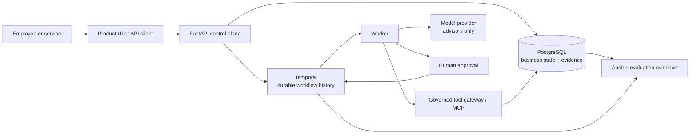

# Agents Should Survive Failure

**A durable control plane for AI workflows that cannot afford to forget, duplicate, or self-authorize important actions.**

Agents Should Survive Failure is a production-style reference implementation for long-running, AI-assisted business workflows. It combines durable orchestration, human approval, governed tool access, business-effect idempotency, audit evidence, and operational visibility.

It is built around a simple idea:

> An agent may be retried. A worker may crash. A network response may be lost. The business outcome must still remain correct.

[](https://github.com/kabbersokhi-boop/agents-should-survive-failure/actions/workflows/ci.yml) [](https://github.com/kabbersokhi-boop/agents-should-survive-failure/releases/latest) [](https://www.python.org/downloads/release/python-3120/) [](LICENSE)

## Why this project exists

Most AI-agent demos focus on the happy path: receive a task, call a model, use a tool, return an answer.

Real business workflows are harder. They may run for minutes or days, wait for a person, cross several systems, and perform actions that must not happen twice. Once an agent can approve, notify, modify, refund, provision, or submit something, model quality is no longer the only concern.

The system also has to answer:

- What happens if a worker crashes after the database write succeeds but before the acknowledgement is received?
- What happens if the same request, callback, or approval is delivered twice?
- How can a workflow wait safely for a human decision?
- Which tools is an agent allowed to call for this specific run?
- Can the model explain evidence without becoming the authority that approves its own recommendation?
- How can an operator reconstruct exactly what happened later?

This repository explores those engineering problems directly.

## What the project is

It is a reference backend and control plane for teams building AI agents that participate in consequential, multi-step operations.

The platform provides:

- **durable orchestration** with Temporal;
- **authoritative business state and evidence** in PostgreSQL;
- **human approval** for consequential decisions;
- **governed tool execution** with run-scoped grants, version pinning, schema validation, approval checks, and idempotency;
- **bounded model usage**, where models explain evidence but do not authorize outcomes;
- **recoverable workflow starts** when a network timeout leaves the start result uncertain;
- **duplicate-safe business effects** across retries and redelivery;
- **audit, metrics, traces, and evaluation evidence** for operators and reviewers;
- a **preview SDK/runtime** for trusted, operator-installed external Python agents.

The intended users are AI engineers, backend engineers, platform engineers, and teams moving from an agent prototype to a dependable internal system.

A business user would normally interact with a simpler product interface built on top of this platform—for example, an approval screen showing the evidence collected by an agent. Engineers operate the API, workflow history, evidence store, tool gateway, and monitoring layer behind that interface.

## The reference workflow

The repository includes one complete, release-proven workflow: **vendor onboarding**.

Vendor onboarding is used because it brings several difficult concerns together in one understandable case:

1. A company submits a new supplier for review.
2. The workflow retrieves vendor and policy evidence through governed tools.
3. Deterministic code calculates a risk score.
4. A model produces a bounded explanation of that evidence.
5. The workflow waits durably for an authorized human decision.
6. An approval creates the approved-vendor record and a synthetic notification.
7. Every important transition is persisted as business and audit evidence.

The value is not limited to suppliers. The same pattern applies to workflows such as:

- investigating an operational incident before taking corrective action;
- reviewing a high-value refund before issuing it;
- collecting evidence for an insurance or compliance case;
- preparing an account or access change that requires approval;
- coordinating an internal IT operation across several systems.

Vendor onboarding is the concrete test vehicle used to prove the broader reliability and governance architecture.

## The core authority model

The project deliberately separates intelligence from authority:

- **Models interpret and explain.**
- **Deterministic code enforces rules.**
- **Authenticated people authorize consequential decisions.**
- **Governed activities and tools perform business effects.**

A model can help explain why a vendor appears risky. It cannot approve the vendor, grant itself new tools, or bypass the governed execution path.

## What happens when something fails

Consider the most dangerous retry window:

1. An approved action commits to PostgreSQL.
2. The worker crashes before Temporal receives the activity-completion acknowledgement.
3. Temporal redelivers the activity to a replacement worker.
4. The activity executes again.
5. Stable idempotency keys, transactions, and uniqueness constraints recognize the already-committed effects.
6. The workflow completes without creating a second approval, projection, or email.

The claim is intentionally precise:

> Execution may happen more than once. The tested business effect commits once.

This is at-least-once execution with exactly-once business effects for the proven workflow—not magical exactly-once distributed execution.

## Architecture



| Component | Responsibility |
| --- | --- |
| Temporal | Durable workflow history, retries, timers, updates, waits, and recovery |
| PostgreSQL | Business truth, approvals, evidence, idempotency, and projections |
| FastAPI control plane | Authenticated workflow, approval, agent, evidence, and operational APIs |
| Worker | Executes activities requested by Temporal |
| Tool gateway | Enforces tool identity, grants, versions, schemas, approval, and idempotency |
| Model provider | Produces bounded explanations without decision authority |
| Observability stack | Exposes health, metrics, traces, workflow state, and release evidence |

Temporal owns orchestration. PostgreSQL owns business truth. Models advise. People and deterministic policy authorize. Governed tools perform effects.

## How to use the repository

There are two distinct paths.

### 1. Run and study the proven workflow

Use the vendor-onboarding path to explore:

- durable workflow execution;
- human approval;
- recoverable starts;
- governed tools and MCP boundaries;
- duplicate-safe effects;
- crash recovery;
- evaluation and audit evidence;
- metrics and traces.

This path does not require the SDK.

### 2. Build a compatible external Python agent

The standalone SDK is a preview developer contract for trusted Python agents that run inside the managed-agent environment.

An agent declares its metadata, task and result schemas, required tools, capabilities, checkpoints, artifacts, and budget defaults. The platform supplies a constrained runtime context for operations such as:

- calling a governed tool;
- saving and loading checkpoints;
- creating digest-verified artifacts;
- requesting human approval;
- emitting progress events;
- checking cancellation and remaining budget.

The independently packaged Operations Investigation Agent demonstrates this integration path.

Existing agents are not connected automatically. They must be adapted to the SDK contract, packaged, installed into the trusted worker environment, registered, and started through the authenticated API.

## Quickstart

Prerequisites: Python 3.12, [uv](https://docs.astral.sh/uv/), Docker, and Docker Compose.

```bash
git clone https://github.com/kabbersokhi-boop/agents-should-survive-failure.git
cd agents-should-survive-failure
uv python install 3.12
uv sync --frozen --all-groups
make up
curl http://127.0.0.1:8000/health/ready
```

Useful local interfaces:

| Interface | Address | Purpose |
| --- | --- | --- |
| FastAPI/OpenAPI | `http://127.0.0.1:8000/docs` | Create cases, approve work, inspect APIs |
| Temporal UI | `http://127.0.0.1:8080` | Inspect workflow history, retries, and waits |
| Grafana | `http://127.0.0.1:3000` | View operational dashboards |
| Prometheus | `http://127.0.0.1:9090` | Inspect metrics |

The [local-development runbook](docs/runbooks/local-development.md) covers API-key setup, authenticated calls, database operations, and the complete local workflow.

## Demonstration

A strong employer demonstration takes about seven minutes:

1. Start the stack and submit a synthetic vendor through the authenticated API.
2. Open Temporal UI and show the workflow waiting durably for approval.
3. Show the risk score, policy evidence, and model explanation.
4. Explain that the model cannot approve its own recommendation.
5. Approve the request and show the completed workflow and persisted evidence.
6. Run the OS-level worker-crash proof.
7. Show that the replacement worker recovers while the database still contains exactly one approval decision, one approved-vendor projection, and one synthetic email.

```bash
make test-worker-crash
```

See the [screen-by-screen demonstration guide](docs/demo.md).

## What was proven in `v0.2.0`

| Evidence | Result |
| --- | --- |
| Production-workflow evaluation | 24/24 reviewed cases passed |
| Runtime | Real Temporal and PostgreSQL execution |
| Crash recovery | Docker worker terminated with `SIGKILL`, followed by replacement-worker recovery |
| Business effects | Exactly one approval decision, approved-vendor projection, and synthetic email |
| Automated tests | 169 unit tests, 21 integration tests, 7 dedicated security tests |
| Database lifecycle | Migration upgrade, downgrade, and re-upgrade through head `b5c6d7e8f9a0` |
| Supply-chain checks | Gitleaks, locked dependency audit, and backend, SDK, and container SBOMs |
| External package proof | Real execution of the separately packaged Operations Investigation Agent |

See the [`v0.2.0` evidence summary](docs/evidence/v0.2.0.md), [GitHub release](https://github.com/kabbersokhi-boop/agents-should-survive-failure/releases/tag/v0.2.0), and [successful GitHub Actions run 29545587083](https://github.com/kabbersokhi-boop/agents-should-survive-failure/actions/runs/29545587083).

## Run the strongest checks

```bash
make validate-evaluation-dataset
make test-worker-crash
make test-managed-agent
make test-integration
```

`make test-integration` builds an isolated Docker Compose project, exercises migrations and the production-workflow evaluator, exports bounded evidence, and removes its containers and volumes.

## Maturity map

| Surface | Status | Supported claim |
| --- | --- | --- |
| Vendor-onboarding workflow | Mature reference workflow | Release-proven durable approval, recovery, and duplicate-safe effects |
| Recoverable workflow starts | Mature reference mechanism | Ambiguous starts can be reconciled without launching duplicates |
| Governed tools and MCP boundary | Mature reference mechanism | Run-scoped grants, version pinning, schemas, approval, idempotency, and evidence |
| Public SDK and managed-agent runtime | Preview | A trusted installed Python agent can run through a constrained context |
| Delegation | Experimental | Implemented but not release-proven as a complete production feature |
| Hostile-code isolation | Not provided | Docker is not represented as a complete security boundary |

## What this project is not

This repository is not presented as a turnkey hosted SaaS product or a finished enterprise agent platform.

It does not currently provide:

- a polished end-user dashboard;
- automatic integration with every existing agent framework;
- an n8n connector or hosted agent-upload service;
- hostile-code isolation for untrusted third-party packages;
- proven multi-tenancy, high availability, enterprise identity, billing, or Kubernetes operation;
- production compliance certification.

The managed-agent SDK/runtime is preview quality, delegation is experimental, and external agent packages are trusted operator-installed code. These boundaries are documented so that the proven workflow is not confused with unfinished platform surfaces.

Read the [plain-English guide](docs/plain-english-guide.md), [limitations](docs/limitations.md), and [threat model](docs/threat-model.md) before adapting the design.

## Repository guide

| Path | Contents |
| --- | --- |
| `src/agents_should_survive_failure/` | FastAPI control plane, workflows, persistence, policy, tools, and evaluation |
| `packages/agents-should-survive-failure-sdk/` | Standalone public SDK preview |
| `packages/example-operations-agent/` | Independently packaged external-agent example |
| `migrations/` | PostgreSQL schema history |
| `scripts/` | Compose, crash-recovery, SDK, and managed-agent proofs |
| `tests/` | Unit, integration, and security tests |
| `deployment/` | PostgreSQL, Temporal, Prometheus, Tempo, and Grafana configuration |
| `docs/` | Architecture, runbooks, evidence, security, demonstration, and limitations |

## Documentation

Start with:

1. [Plain-English guide](docs/plain-english-guide.md)
2. [Demonstration guide](docs/demo.md)
3. [Local-development runbook](docs/runbooks/local-development.md)
4. [System boundaries and architecture](docs/adr/0001-system-boundaries.md)
5. [`v0.2.0` release evidence](docs/evidence/v0.2.0.md)

The complete [documentation index](docs/README.md) links to the evaluation, SDK, security, operational, and historical material.

## License

Licensed under the Apache License 2.0. See [LICENSE](LICENSE).
