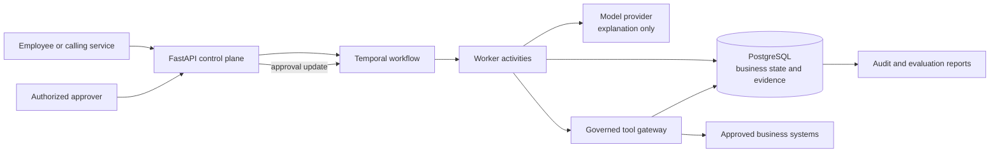
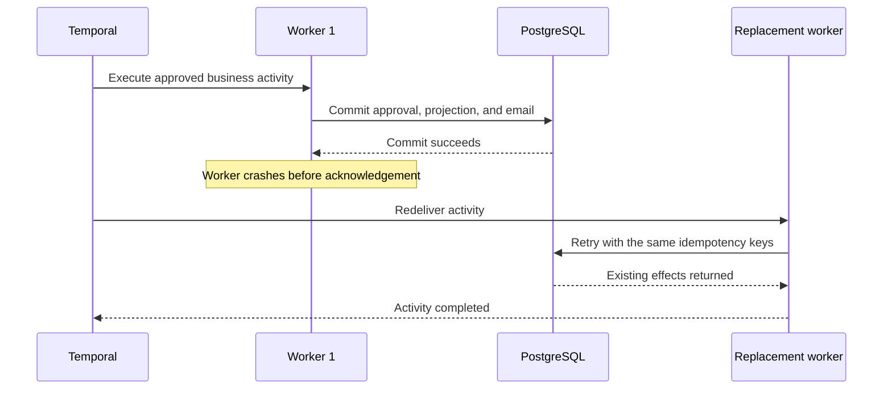

# Agents Should Survive Failure

**Durable execution and governance for AI workflows that must remain correct through retries, delayed approvals, uncertain network outcomes, and worker crashes.**

[](https://github.com/kabbersokhi-boop/agents-should-survive-failure/actions/workflows/ci.yml) [](https://github.com/kabbersokhi-boop/agents-should-survive-failure/releases/latest) [](https://www.python.org/downloads/release/python-3120/) [](LICENSE)

> **Core invariant:** execution may happen more than once; the tested business effect commits once.

This repository is a production-style reference implementation of the reliability layer around an AI-assisted business process. Temporal owns durable orchestration, PostgreSQL owns business truth and evidence, authenticated people authorize consequential decisions, and governed tools perform effects without giving the model unrestricted authority.

## Why this project exists

A model call is usually the easiest part of an agent system.

The difficult part begins when the agent participates in real operations:

- a worker crashes after a database write succeeds but before the acknowledgement is received;
- the same request, callback, or approval is delivered twice;
- a network timeout makes the outcome of a tool call uncertain;
- a workflow must wait hours or days for a person;
- a retry must not issue a second refund, email, account change, or approval;
- an operator must later prove what happened and who authorized it.

Those are distributed-systems, authorization, and operational-correctness problems. This project addresses them directly instead of treating the happy-path agent loop as the whole product.

## Verified release evidence

The accepted `v0.2.0` release is tied to commit [`b28e3cf4`](https://github.com/kabbersokhi-boop/agents-should-survive-failure/commit/b28e3cf4ab6fad2ed4726a6e25dcad49594d8ccc) and successful GitHub Actions run [`29545587083`](https://github.com/kabbersokhi-boop/agents-should-survive-failure/actions/runs/29545587083).

| Proof | Verified result |
| --- | --- |
| Reviewed workflow evaluation | **24/24 cases passed** against real Temporal and PostgreSQL execution |
| OS-level crash recovery | Docker worker terminated with `SIGKILL`; a replacement worker recovered the redelivered activity |
| Duplicate-safe business effects | Exactly **one** approval decision, **one** approved-vendor projection, and **one** synthetic email after recovery |
| Automated tests | **169 unit tests**, **21 integration tests**, and **7 dedicated security tests** |
| Database lifecycle | Migration upgrade, downgrade, and re-upgrade completed through head `b5c6d7e8f9a0` |
| Supply-chain checks | Gitleaks, locked dependency audit, and CycloneDX SBOMs for the backend, SDK, and container |
| External package proof | The separately packaged Operations Investigation Agent executed through the managed-agent runtime |

The release includes JSON and Markdown evaluation reports plus generated SBOMs. See the [`v0.2.0` evidence summary](docs/evidence/v0.2.0.md), [release assets](https://github.com/kabbersokhi-boop/agents-should-survive-failure/releases/tag/v0.2.0), and [successful CI run](https://github.com/kabbersokhi-boop/agents-should-survive-failure/actions/runs/29545587083).

The release evidence is deliberately scoped: the vendor-onboarding workflow is the mature reference path; the generic managed-agent SDK/runtime is preview quality and delegation is experimental.

## What the project is

It is a backend control plane for consequential, multi-step AI workflows. It provides:

- **durable orchestration** with Temporal;
- **authoritative business state and audit evidence** in PostgreSQL;
- **recoverable workflow starts** when the start outcome is unknown;
- **human approval** for consequential decisions;
- **governed tool execution** with run-scoped grants, version pinning, schema checks, approval gates, timeouts, and idempotency;
- **bounded model participation**, where a model explains evidence but cannot authorize its own recommendation;
- **duplicate-safe business effects** across retries and redelivery;
- **metrics, traces, workflow history, and evaluation evidence** for operators;
- a **preview SDK/runtime** for trusted, operator-installed Python agents.

A useful way to read the system is:

> **Temporal remembers. PostgreSQL records the truth. Models advise. People and policy authorize. Governed tools act.**

## Who it is for

The direct audience is:

- AI engineers building agents that touch business systems;
- backend engineers responsible for correctness across retries and failures;
- platform teams providing approvals, tool access, evidence, and observability to multiple workflows;
- teams moving from an agent prototype or automation flow to a controlled internal service.

The same architecture can support incident response, high-value refunds, insurance or compliance review, account changes, access provisioning, and internal IT operations. The repository implements one complete reference workflow rather than pretending to ship every possible product.

## Reference workflow: vendor onboarding

The release-proven workflow reviews and approves a new supplier:

1. An authenticated client submits a vendor.
2. The workflow retrieves vendor and policy evidence through governed tools.
3. Deterministic code calculates a risk score.
4. A model produces a bounded explanation of the evidence.
5. Temporal waits durably for an authorized human decision.
6. Approval records the vendor projection and creates a synthetic notification.
7. Business events, model evidence, tool invocations, approvals, and audit records remain queryable.

Vendor onboarding was selected because it combines evidence gathering, model assistance, human authority, external effects, long waits, retries, and duplicate risk in one understandable scenario. The reusable engineering work is the control plane around that scenario.

## Authority model

The project separates intelligence from authority:

- **Models interpret and explain.**
- **Deterministic code enforces rules.**
- **Authenticated principals authorize consequential decisions.**
- **Governed activities and tools perform business effects.**

A model can explain why a vendor appears risky. It cannot approve the vendor, grant itself additional tools, or bypass the governed execution path.

## Architecture

### System structure



A client starts work through the API. Temporal tracks the durable workflow state, workers perform activities, governed tools mediate external effects, PostgreSQL stores business truth and evidence, and human approval returns through the authenticated API rather than through the model.

### Crash-recovery path



The activity may be redelivered and executed again, but stable idempotency keys and database constraints prevent a second business effect.

| Component | Responsibility |
| --- | --- |
| Temporal | Workflow history, retries, updates, durable waits, redelivery, and recovery |
| PostgreSQL | Business truth, approvals, evidence, idempotency, and projections |
| FastAPI control plane | Authenticated workflow, approval, agent, evidence, and operational APIs |
| Worker | Executes activities requested by Temporal |
| Tool gateway | Enforces tool identity, grants, versions, schemas, approval, and idempotency |
| Model provider | Produces bounded explanations without decision authority |
| Observability stack | Exposes health, metrics, traces, workflow state, and release evidence |

## The failure this project proves

The strongest proof targets the dangerous post-commit window:

1. The approval, approved-vendor projection, and synthetic email commit to PostgreSQL.
2. Before the activity can acknowledge completion, the Docker worker is killed with `SIGKILL`.
3. A replacement worker starts.
4. Temporal redelivers the activity because it cannot assume the lost acknowledgement meant completion.
5. The activity executes again.
6. Stable idempotency keys, transactions, and database constraints converge on the already-committed effects.
7. The workflow completes with exactly one of each business effect.

Run that proof with:

```bash
make test-worker-crash
```

A successful run prints the workflow ID and final one-row counts for decisions, projections, and emails.

## How to use this repository

### 1. Run the reference platform

Use the vendor-onboarding workflow to study durable execution, approvals, recoverable starts, governed tools, MCP boundaries, audit evidence, and crash recovery. This path does not require the SDK.

### 2. Reproduce the release proofs

```bash
make validate-evaluation-dataset
make test-worker-crash
make test-managed-agent
make test-integration
```

- `make validate-evaluation-dataset` validates the reviewed 24-case catalog and its digest.
- `make test-worker-crash` performs the real OS-level worker termination and recovery proof.
- `make test-managed-agent` executes the separately packaged example agent through the preview runtime.
- `make test-integration` builds an isolated Compose stack, exercises migrations and the real workflow evaluator, exports evidence, and cleans up.

### 3. Build a compatible Python agent

The standalone SDK is a preview developer contract for trusted Python agents. An agent declares metadata, task and result schemas, tools, capabilities, checkpoints, artifacts, and budget defaults. The platform supplies a constrained runtime context for:

- governed tool calls;
- checkpoints and digest-verified artifacts;
- human approval requests;
- progress events;
- cancellation checks;
- budget inspection.

The [Operations Investigation Agent](packages/example-operations-agent/) is packaged independently and demonstrates entry-point discovery and managed execution.

Existing agents are not connected automatically. They must be adapted to the SDK contract, installed into the trusted worker environment, registered, and started through the authenticated API.

## Quickstart

Prerequisites: Python 3.12, [uv](https://docs.astral.sh/uv/), Docker, and Docker Compose.

```bash
git clone https://github.com/kabbersokhi-boop/agents-should-survive-failure.git
cd agents-should-survive-failure
uv python install 3.12
uv sync --frozen --all-groups
make up
curl http://127.0.0.1:8000/health/ready
```

Useful local interfaces:

| Interface | Address | Purpose |
| --- | --- | --- |
| FastAPI/OpenAPI | `http://127.0.0.1:8000/docs` | Create cases, approve decisions, and inspect APIs |
| Temporal UI | `http://127.0.0.1:8080` | Inspect workflow history, retries, and durable waits |
| Grafana | `http://127.0.0.1:3000` | View operational dashboards |
| Prometheus | `http://127.0.0.1:9090` | Inspect metrics |

The [local-development runbook](docs/runbooks/local-development.md) covers API-key setup, authenticated calls, database operations, and the complete local workflow. The [guided live walkthrough](docs/demo.md) shows the reference scenario, approval wait, stored evidence, and crash-recovery proof screen by screen.

## Maturity and scope

| Surface | Status | Supported claim |
| --- | --- | --- |
| Vendor-onboarding workflow | Mature reference workflow | Release-proven durable approval, recovery, and duplicate-safe effects |
| Recoverable workflow starts | Mature reference mechanism | Ambiguous starts can be reconciled without launching duplicates |
| Governed tools and MCP boundary | Mature reference mechanism | Run-scoped grants, version pinning, schema checks, approval, idempotency, and evidence |
| Public SDK and managed-agent runtime | Preview | A trusted installed Python agent can run through a constrained context |
| Delegation | Experimental | Implemented, but not release-proven as a complete production feature |
| Hostile-code isolation | Not provided | Docker is not represented as a complete security boundary |

## What it does not claim

This is a reference implementation, not a turnkey hosted SaaS product or a finished enterprise platform. It does not claim:

- hostile-code isolation for arbitrary third-party packages;
- proven multi-tenancy, high availability, enterprise identity, billing, or Kubernetes operation;
- automatic compatibility with every agent framework or no-code platform;
- production compliance certification.

External agent packages are trusted, operator-installed code. NVIDIA NIM live checks require credentials and are not part of public CI. Read the [limitations](docs/limitations.md) and [threat model](docs/threat-model.md) before adapting the design.

## Repository map

| Path | Contents |
| --- | --- |
| `src/agents_should_survive_failure/` | FastAPI control plane, workflows, persistence, policy, tools, and evaluation |
| `packages/agents-should-survive-failure-sdk/` | Standalone public SDK preview |
| `packages/example-operations-agent/` | Independently packaged external-agent example |
| `migrations/` | PostgreSQL schema history |
| `scripts/` | Compose, crash-recovery, SDK, and managed-agent proofs |
| `tests/` | Unit, integration, and security tests |
| `deployment/` | PostgreSQL, Temporal, Prometheus, Tempo, and Grafana configuration |
| `docs/` | Architecture, runbooks, evidence, security, walkthroughs, and limitations |

## Documentation

- [Release evidence](docs/evidence/v0.2.0.md)
- [Local-development runbook](docs/runbooks/local-development.md)
- [Guided live walkthrough](docs/demo.md)
- [System boundaries and architecture](docs/adr/0001-system-boundaries.md)
- [Evaluation methodology](docs/evaluation-methodology.md)
- [Threat model](docs/threat-model.md)
- [Limitations](docs/limitations.md)
- [Complete documentation index](docs/README.md)

## License

Licensed under the Apache License 2.0. See [LICENSE](LICENSE).
