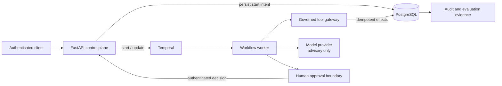
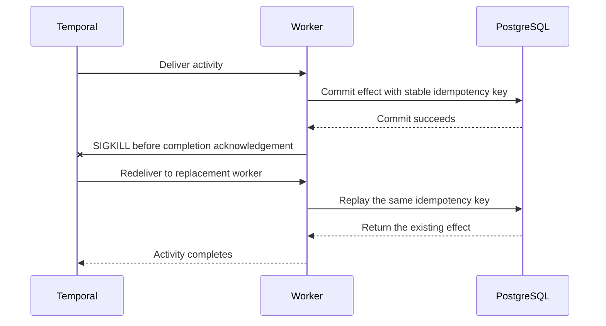

# Agents Should Survive Failure

**A durable execution and governance layer for AI-assisted business workflows that survives
worker crashes, waits safely for human approval, and prevents duplicate business effects.**

[](https://github.com/kabbersokhi-boop/agents-should-survive-failure/actions/workflows/ci.yml)
[](https://github.com/kabbersokhi-boop/agents-should-survive-failure/releases/latest)
[](pyproject.toml)
[](LICENSE)

> **Core invariant:** execution may happen more than once; the business effect commits once.

## The failure this project proves

A worker commits an approval, an approved-vendor projection, and a synthetic notification. Before
it can acknowledge completion to Temporal, the process receives `SIGKILL`.

Temporal starts a replacement worker and redelivers the activity. Stable idempotency keys,
transactions, and PostgreSQL uniqueness constraints make that replay converge on the effects that
already committed:

```text
Worker crash proof passed: run=<uuid> decisions=1 projections=1 emails=1
retry=temporal-redelivery
```

Run the real proof locally:

```bash
make demo
```

This is at-least-once execution with exactly-once **business effects** for the tested workflow. It
does not claim exactly-once distributed execution.

## Why this is different

Most agent demos prove that a model can complete a task when every dependency works. This
repository exercises the harder boundaries around consequential workflows:

- a worker disappears after its database commit but before its acknowledgement;
- a workflow start times out after intent has been persisted;
- approvals arrive twice, conflict, or refer to a stale request version;
- model and governed-tool calls fail or are retried;
- an agent requests a tool or tool version outside its immutable run grant;
- a long-running workflow waits for an authenticated human without keeping progress in memory.

Models interpret bounded evidence. They do not grant themselves authority, calculate the final
policy decision, or commit business effects.

## System guarantees

| Guarantee | Mechanism | Evidence |
| --- | --- | --- |
| Durable execution | Temporal workflow history, retries, updates, and replacement workers | [Worker-crash proof](scripts/worker_crash_proof.py) |
| Duplicate-safe effects | Stable idempotency keys, SQL transactions, and uniqueness constraints | [Integration tests](tests/integration/test_vendor_onboarding_workflow.py) |
| Recoverable starts | Persisted start intent reconciled against a stable Temporal workflow ID | [Start coordinator](src/agents_should_survive_failure/workflow_starts.py) |
| Human authority | Scoped API keys, versioned approval requests, and idempotent decisions | [Approval tests](tests/unit/test_approval_updates_api.py) |
| Governed tools | Run-scoped grants, pinned versions, schema validation, and invocation audit | [Tool gateway](src/agents_should_survive_failure/tool_gateway.py) |
| Bounded model role | Deterministic risk policy and advisory-only model explanations | [Model evidence service](src/agents_should_survive_failure/model_evidence.py) |
| Auditable operation | Ordered events, traces, metrics, evaluation reports, and SBOMs | [Release evidence](docs/evidence/v0.2.0.md) |

## Architecture



The system deliberately separates five kinds of authority:

1. **Temporal** owns durable coordination and redelivery.
2. **PostgreSQL** owns business truth, audit evidence, and idempotency constraints.
3. **Deterministic policy** owns risk calculation and authorization boundaries.
4. **The model provider** explains supplied evidence within an output budget.
5. **An authenticated human or service** approves consequential decisions.

### Post-commit recovery



## Reference workflows

Both examples use the same start, approval, governed-tool, persistence, and observability
contracts. They differ only in domain evidence, risk rules, and final projections.

| Engine capability | Vendor onboarding | High-value refund |
| --- | --- | --- |
| Evidence retrieval | Vendor and policy lookup | Order details and refund policy |
| Deterministic policy | Jurisdiction risk | Amount and order-state risk |
| Human decision | Approve or reject supplier | Approve or reject refund |
| Idempotent result | Approved vendor and email | Refund projection and notification |
| Current maturity | Release-proven reference workflow | Implemented on `main`; next release candidate |

The vendor-onboarding workflow is the mature release proof. The refund workflow demonstrates that
the engine contracts generalize to a second domain; it will not be described as release-proven
until its evaluation evidence ships with the next release.

## Verified evidence

The [`v0.2.0` release](https://github.com/kabbersokhi-boop/agents-should-survive-failure/releases/tag/v0.2.0)
is tied to commit `b28e3cf4` and includes machine-readable evaluation reports, Python and container
SBOMs, and independently installable SDK/example-agent distributions.

| Release check | Result |
| --- | --- |
| Reviewed production-workflow scenarios | 24/24 passed against real Temporal and PostgreSQL execution |
| Worker loss | Real Docker worker killed with `SIGKILL` and replaced |
| Effects after redelivery | Exactly one approval, projection, and synthetic email |
| Schema lifecycle | Upgrade, downgrade, re-upgrade, and reseed verified |
| Supply chain | Gitleaks, locked dependency audit, and three CycloneDX SBOMs |
| CI | [Successful release run 29545587083](https://github.com/kabbersokhi-boop/agents-should-survive-failure/actions/runs/29545587083) |

Read the committed [release evidence summary](docs/evidence/v0.2.0.md) and
[evaluation methodology](docs/evaluation-methodology.md) for the exact contract and limitations.

## Quickstart

Prerequisites: Python 3.12, [uv](https://docs.astral.sh/uv/), Docker, and Docker Compose.

```bash
make setup
make up
curl --fail http://127.0.0.1:8000/health/ready
```

| Interface | URL | Purpose |
| --- | --- | --- |
| FastAPI / OpenAPI | `http://127.0.0.1:8000/docs` | Start workflows and submit approvals |
| Temporal UI | `http://127.0.0.1:8080` | Inspect history, waits, retries, and recovery |
| Grafana | `http://127.0.0.1:3000` | Inspect API, worker, workflow, tool, model, and cost signals |
| Prometheus | `http://127.0.0.1:9090` | Query bounded operational metrics |

`make down` stops the stack without deleting its volumes. The
[local runbook](docs/runbooks/local-development.md) contains the authenticated API sequence and
database lifecycle commands.

## Verification

```bash
make lint typecheck test test-security
make test-integration
make demo
```

`make test-integration` creates an isolated Compose project, runs reversible migrations, executes
the reviewed evaluation suite, proves worker-crash recovery, verifies the separately packaged
managed agent, generates evaluation reports and SBOMs, and removes the isolated environment.

CI has three independent jobs:

- **Quality:** formatting, strict Pyright, unit/security tests, dependency audit, package install
  proofs, secret scanning, and backend/SDK SBOMs.
- **Docker:** reproducible image build and container SBOM.
- **Integration:** Temporal/PostgreSQL execution, migrations, evaluation, crash recovery, managed
  agent, and observability provisioning.

## Implementation tour

| Area | Start here |
| --- | --- |
| Durable workflows | [`workflows/vendor_onboarding.py`](src/agents_should_survive_failure/workflows/vendor_onboarding.py), [`workflows/refund/`](src/agents_should_survive_failure/workflows/refund/) |
| Recoverable workflow starts | [`workflow_starts.py`](src/agents_should_survive_failure/workflow_starts.py) |
| Governed tools and MCP | [`tool_gateway.py`](src/agents_should_survive_failure/tool_gateway.py), [`mcp_adapter.py`](src/agents_should_survive_failure/mcp_adapter.py) |
| Persistence and idempotency | [`persistence/models.py`](src/agents_should_survive_failure/persistence/models.py), [`migrations/`](migrations/) |
| Evaluation system | [`evaluation_scenarios.py`](src/agents_should_survive_failure/evaluation_scenarios.py), [`evaluation.py`](src/agents_should_survive_failure/evaluation.py) |
| Security boundaries | [`docs/threat-model.md`](docs/threat-model.md), [`tests/security/`](tests/security/) |
| External agent contract | [`packages/agents-should-survive-failure-sdk/`](packages/agents-should-survive-failure-sdk/), [`packages/example-operations-agent/`](packages/example-operations-agent/) |
| Observability | [`metrics.py`](src/agents_should_survive_failure/metrics.py), [`deployment/`](deployment/) |

Thirteen [architecture decision records](docs/adr/) document why the system assigns ownership this
way instead of hiding the tradeoffs behind framework defaults.

## Maturity and scope

| Surface | Status |
| --- | --- |
| Vendor onboarding and crash-recovery proof | Release-proven reference implementation |
| High-value refund | Implemented on `main`; pending next release evidence |
| Managed-agent SDK/runtime | Preview |
| Delegation | Experimental and not release-proven |
| NVIDIA NIM providers | Credential-gated manual smoke tests |

This repository is a production-style reference implementation, not a hosted platform, compliance
product, or claim of production readiness. It does not claim multi-tenancy, high availability,
enterprise identity, Kubernetes operation, billing, or hostile-code isolation. External agent
packages are trusted, operator-installed code.

See the full [limitations](docs/limitations.md), [failure cases](docs/failure-cases.md), and
[threat model](docs/threat-model.md).

## Documentation

- [Five-to-ten-minute technical demonstration](docs/demo.md)
- [Plain-English system guide](docs/plain-english-guide.md)
- [Local development runbook](docs/runbooks/local-development.md)
- [Evaluation methodology](docs/evaluation-methodology.md)
- [Tool and agent trust model](docs/security/tool-and-agent-trust.md)
- [Architecture decisions](docs/adr/)

## License

Licensed under the Apache License 2.0. See [LICENSE](LICENSE).
