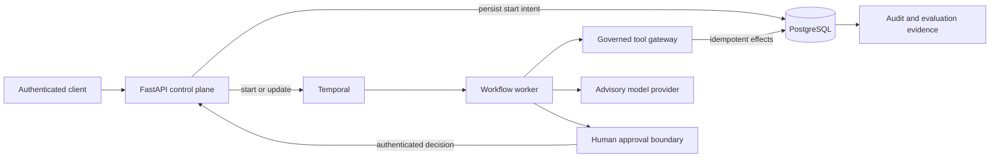

# Agents Should Survive Failure

**A durable execution and governance reference for AI-assisted workflows. It survives worker
crashes, waits for human approval, and prevents duplicate business effects.**

[](https://github.com/kabbersokhi-boop/agents-should-survive-failure/actions/workflows/ci.yml)
[](https://github.com/kabbersokhi-boop/agents-should-survive-failure/releases/latest)
[](pyproject.toml)
[](LICENSE)

> **Core invariant:** execution can occur more than once; each business effect commits once.

## Failure proof

The reference workflow commits an approval, a vendor projection, and a synthetic notification.
The worker then receives `SIGKILL` before it can acknowledge completion to Temporal. A replacement
worker receives the activity again. Stable idempotency keys, database transactions, and PostgreSQL
uniqueness constraints make the replay converge on the committed effects.

```text
Worker crash proof passed: run=<uuid> decisions=1 projections=1 emails=1
retry=temporal-redelivery
```

Run the proof against real Temporal and PostgreSQL services:

```bash
make demo
```

This is at-least-once execution with exactly-once business effects for the tested workflow. It is
not a claim of exactly-once distributed execution.

## Engineering guarantees

| Guarantee | Mechanism | Executable evidence |
| --- | --- | --- |
| Durable execution | Temporal history, retries, updates, and replacement workers | [Crash proof](scripts/worker_crash_proof.py) |
| Duplicate-safe effects | Stable keys, SQL transactions, and unique constraints | [Integration tests](tests/integration/test_vendor_onboarding_workflow.py) |
| Recoverable starts | Persisted start intent and stable workflow identity | [Start coordinator](src/agents_should_survive_failure/workflow_starts.py) |
| Human authority | Scoped keys, versioned requests, and idempotent decisions | [Approval tests](tests/unit/test_approval_updates_api.py) |
| Governed tools | Run-scoped grants, pinned versions, schema validation, and audit | [Tool gateway](src/agents_should_survive_failure/tool_gateway.py) |
| Bounded model role | Deterministic risk policy; advisory model explanations | [Model evidence service](src/agents_should_survive_failure/model_evidence.py) |

## Architecture



Authority stays separated by design:

1. Temporal owns durable coordination and redelivery.
2. PostgreSQL owns business truth, audit records, and idempotency constraints.
3. Deterministic policy owns risk calculation and authorization boundaries.
4. The model explains bounded evidence; it does not grant authority.
5. An authenticated human or service approves consequential decisions.

The same contracts support vendor onboarding and high-value refunds. Vendor onboarding is the
release-backed reference workflow. The refund workflow demonstrates reuse of the engine contracts
and remains a preview until its evaluation evidence is part of a release.

## Run locally

Requirements: Python 3.12, [uv](https://docs.astral.sh/uv/), Docker, and Docker Compose.

```bash
make setup
make up
curl --fail http://127.0.0.1:8000/health/ready
```

| Interface | Local URL | Purpose |
| --- | --- | --- |
| FastAPI / OpenAPI | `http://127.0.0.1:8000/docs` | Start workflows and submit approvals |
| Temporal UI | `http://127.0.0.1:8080` | Inspect history, waits, retries, and recovery |
| Grafana | `http://127.0.0.1:3000` | Inspect API, workflow, tool, model, and cost signals |
| Prometheus | `http://127.0.0.1:9090` | Query bounded operational metrics |

Use `make down` to stop the stack without deleting its volumes. The
[local runbook](docs/runbooks/local-development.md) contains the authenticated API sequence and
database lifecycle commands.

## Verify the system

```bash
make lint typecheck test test-security
make test-integration
make demo
```

The integration target creates an isolated Compose project, tests reversible migrations, runs the
reviewed evaluation suite, proves crash recovery, verifies the separately packaged reference
agent, generates evaluation reports and SBOMs, and removes the isolated environment.

The `v0.2.0` release contains evaluation reports and SBOMs for the vendor-onboarding reference
workflow. The [post-release evidence index](docs/evidence/v0.2.0.md) identifies the release commit,
the successful Actions run, the attached artifacts, and the exact limitations.

## Code tour

| Area | Start here |
| --- | --- |
| Durable workflows | [`workflows/vendor_onboarding.py`](src/agents_should_survive_failure/workflows/vendor_onboarding.py), [`workflows/refund/`](src/agents_should_survive_failure/workflows/refund/) |
| Workflow starts | [`workflow_starts.py`](src/agents_should_survive_failure/workflow_starts.py) |
| Governed tools and MCP | [`tool_gateway.py`](src/agents_should_survive_failure/tool_gateway.py), [`mcp_adapter.py`](src/agents_should_survive_failure/mcp_adapter.py) |
| Persistence | [`persistence/models.py`](src/agents_should_survive_failure/persistence/models.py), [`migrations/`](migrations/) |
| Evaluation | [`evaluation_scenarios.py`](src/agents_should_survive_failure/evaluation_scenarios.py), [`evaluation.py`](src/agents_should_survive_failure/evaluation.py) |
| Security | [`docs/threat-model.md`](docs/threat-model.md), [`tests/security/`](tests/security/) |
| External contract | [`packages/agents-should-survive-failure-sdk/`](packages/agents-should-survive-failure-sdk/), [`packages/reference-operations-agent/`](packages/reference-operations-agent/) |
| Observability | [`metrics.py`](src/agents_should_survive_failure/metrics.py), [`deployment/`](deployment/) |

Thirteen [architecture decision records](docs/adr/) explain the main ownership and reliability
trade-offs.

## Scope

This repository is a production-style reference implementation, not a hosted service or a claim
of production readiness. It does not provide multi-tenancy, high availability, enterprise
identity, Kubernetes operation, billing, or hostile-code isolation. External agent packages are
trusted, operator-installed code.

Read the [limitations](docs/limitations.md), [failure cases](docs/failure-cases.md), and
[threat model](docs/threat-model.md) before adapting the design.

## Documentation

- [Technical walkthrough](docs/technical-walkthrough.md)
- [System overview](docs/system-overview.md)
- [Evaluation methodology](docs/evaluation-methodology.md)
- [Tool and agent trust model](docs/security/tool-and-agent-trust.md)
- [Architecture decisions](docs/adr/)

Licensed under the [Apache License 2.0](LICENSE).
