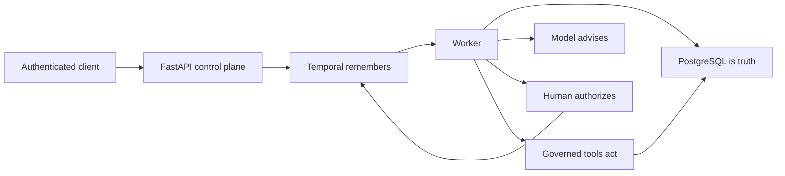
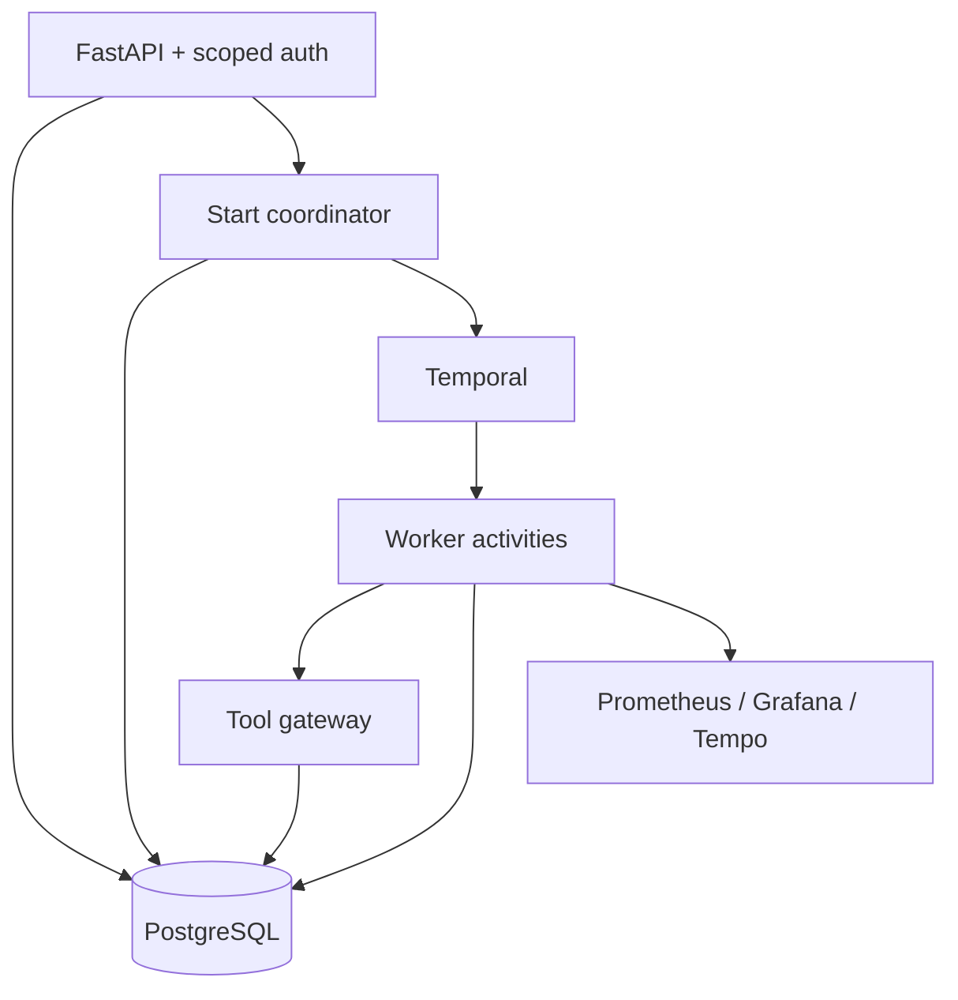

# Durable Agentic Control Plane - Agents That Survive Failure

[](https://github.com/kabbersokhi-boop/agents-should-survive-failure/actions/workflows/ci.yml) [](https://www.python.org/downloads/release/python-3120/) [](LICENSE) [](https://temporal.io/) [](https://www.postgresql.org/) [](https://github.com/kabbersokhi-boop/agents-should-survive-failure/actions)

> **Important:** This is not a vendor onboarding app. Vendor onboarding is Example 1, used to prove the platform. The same engine now runs Example 2: High-Value Refunds. The engine can run any consequential workflow.

Not a chatbot. A crash-safe execution layer for AI agents that touch real money.

> **Core invariant:** execution may happen more than once; business effect commits once.

## Why 99% of Agent Demos Fail in Production

- A process dies after the database write and before acknowledgement.
- A timeout leaves the caller unable to tell whether the action happened.
- A retry sends the same email or creates the same projection twice.
- An approval callback arrives twice or arrives after the request changed.
- A model is allowed to authorize a consequential action.
- Tool permissions drift while a long-running workflow is waiting.

## What This Actually Is



Temporal owns durable orchestration and redelivery. PostgreSQL owns business state, audit, and uniqueness constraints. The model explains evidence. A human authorizes. Governed tools act only with a run-scoped grant, pinned version, validated schema, and stable idempotency key.

## Platform vs Example

| Engine guarantee | Example 1: Vendor onboarding | Example 2: High-value refund |
| --- | --- | --- |
| Durable Temporal workflow and approval wait | Review supplier risk | Review refund risk |
| Deterministic risk calculation | Jurisdiction score | Amount, order-state, and evidence score |
| Governed, version-pinned tools | Vendor lookup and policy search | Order details and refund policy |
| Human approval through the API | Approve or reject vendor | Approve or reject refund |
| Idempotent Postgres effect and audit | Approved-vendor projection and email | Refund projection and notification |

## The Proof No One Else Shows

`make test-worker-crash` runs a real Compose stack, kills the worker with `SIGKILL`, lets Temporal redeliver work, and verifies that PostgreSQL contains exactly one business projection and one synthetic email.

```mermaid
sequenceDiagram
    participant T as Temporal
    participant W as Worker
    participant P as PostgreSQL
    T->>W: Deliver activity
    W->>P: Commit effect with idempotency key
    P-->>W: Commit acknowledged
    W-xT: SIGKILL before completion acknowledgement
    T->>W: Redeliver activity
    W->>P: Replay same idempotency key
    P-->>W: Existing effect returned; no duplicate
```

```text
[crash] worker terminated with SIGKILL
[recovery] replacement worker ready
[proof] approved_vendor_count=1 synthetic_email_count=1
PASS: at-least-once execution with exactly-once business effects
```

[DEMO GIF HERE - run make test-worker-crash]

## Architecture and Crash Recovery



The start coordinator persists intent before handing it to Temporal. Activity retries are expected. Unique constraints on business projections, notifications, decisions, and tool invocations make retries harmless. Audit rows describe the durable transition without storing private model reasoning.

## Live Demo in 60 Seconds

```bash
make up
curl http://127.0.0.1:8000/health/ready
# Authenticate with a scoped API key, then:
curl -X POST http://127.0.0.1:8000/api/v1/vendors ...
curl -X POST http://127.0.0.1:8000/api/v1/vendors/$VENDOR_ID/onboarding ...
curl -X POST http://127.0.0.1:8000/api/v1/workflows/refund/start ...
curl -X POST http://127.0.0.1:8000/api/v1/workflow-runs/$RUN_ID/approval ...
```

Open Grafana at `http://localhost:3000` and inspect **Workflow Cost and Reliability**. The Temporal UI is at `http://localhost:8080`. Use `scripts/show-costs.sh` for a terminal view.

[Grafana screenshot here]

## Tech Stack Hiring Managers Look For

| Layer | Technology | Why it matters |
| --- | --- | --- |
| Durable orchestration | Temporal | Redelivery, timers, updates, recovery |
| Truth and audit | PostgreSQL | Transactions, constraints, evidence |
| Control plane | FastAPI | Authenticated, typed operational API |
| Tool execution | Governed gateway + MCP adapter | Grants, schema checks, version pinning |
| Observability | Prometheus, Grafana, OpenTelemetry, Tempo | Cost, latency, retries, traces |

## Evaluation Evidence

- 24/24 reviewed production-workflow evaluation cases.
- 171 unit tests, 21 integration tests, and 7 dedicated security tests.
- Migration upgrade, downgrade, and re-upgrade coverage.
- Gitleaks, dependency audit, and backend, SDK, and container SBOM targets.
- Real Docker worker-crash proof and independently packaged managed-agent proof.

The original [v0.2.0 evidence summary](docs/evidence/v0.2.0.md), [release](https://github.com/kabbersokhi-boop/agents-should-survive-failure/releases/tag/v0.2.0), and [CI run](https://github.com/kabbersokhi-boop/agents-should-survive-failure/actions/runs/29545587083) remain useful historical references.

## What This Is NOT

- Not a chatbot framework or an autonomous authorization system.
- Not exactly-once distributed execution; it is at-least-once execution with exactly-once effects.
- Not a replacement for business policy, human accountability, or database review.
- Not hostile-code isolation for operator-installed external packages.
- Not a claim that a deterministic local provider represents production model quality.

## How to Run

Prerequisites: Python 3.12, [uv](https://docs.astral.sh/uv/), Docker, and Docker Compose.

```bash
git clone https://github.com/kabbersokhi-boop/agents-should-survive-failure.git
cd agents-should-survive-failure
uv sync --frozen --all-groups
make up
make test
make test-refund-workflow
make validate-evaluation-dataset
```

Run `make down` to stop the stack. The [local development runbook](docs/runbooks/local-development.md), [architecture](docs/adr/0001-system-boundaries.md), [demo guide](docs/demo.md), [security model](docs/threat-model.md), and [limitations](docs/limitations.md) retain the detailed operational material.

## Roadmap

- Example 3: access provisioning with approval and rollback.
- Example 3: incident response with bounded investigation and operator authorization.
- Broader cost attribution from provider usage and workflow budgets.

## License

Apache License 2.0. See [LICENSE](LICENSE).
