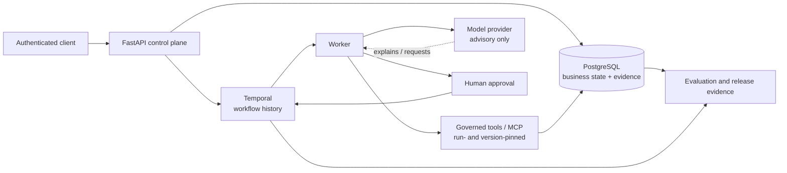

# Agents Should Survive Failure

Durable, governed AI workflows that survive retries and worker crashes without duplicating consequential business effects.

[](https://github.com/kabbersokhi-boop/agents-should-survive-failure/actions/workflows/ci.yml) [](https://github.com/kabbersokhi-boop/agents-should-survive-failure/releases/latest) [](https://www.python.org/downloads/release/python-3120/) [](LICENSE)

## Overview

This project is a durable control plane for AI-assisted business workflows. It keeps a long-running case understandable and recoverable when processes crash, messages arrive twice, approvals are delayed, or a network call times out.

The reference workflow is vendor onboarding: review a supplier, retrieve policy, wait for a human decision, and perform approved business effects with durable evidence. It is not a chatbot, a compliance product, or a claim of production readiness.

The key boundary is deliberate: models can explain and request governed tools, but deterministic policy and human approval authorize consequential work. The release proves at-least-once execution with exactly-once business effects for the tested workflow.

## The business problem

Consider a company onboarding a supplier that may handle payments or access sensitive systems. In an ordinary distributed application:

- A process can crash after writing to a database but before acknowledging the message.
- An approval callback can be delivered twice.
- A timeout can leave the caller unsure whether an action happened.
- A retry can send the same email or create the same approved-vendor record again.
- An AI model can accidentally be given authority that should belong to policy and a person.

These are operational correctness problems, not just model-quality problems.

## How the platform handles it

The vendor-onboarding flow creates a durable case, gathers risk and policy evidence, and waits for a human approval. Once approved, governed activities write the approved-vendor projection and a synthetic email. Every consequential operation carries a stable idempotency key and is constrained by database uniqueness and run-scoped grants.

The main components have clear ownership:

| Component | Responsibility | Analogy |
| --- | --- | --- |
| Temporal | Workflow history, retries, timers, updates, and recovery | Durable case manager |
| PostgreSQL | Business state, audit evidence, idempotency, and release evidence | Official business record |
| Worker | Performs activities requested by the workflow | Process currently performing a step |
| Tool gateway | Checks identity, grants, versions, input, and idempotency | Security desk for every operation |
| Idempotency key | Names one intended business effect across retries | Receipt number preventing duplicate processing |

## Architecture



Temporal owns orchestration. PostgreSQL owns business state and evidence. Models explain but do not authorize. Consequential effects pass through governed activities and tools.

## What was proven in `v0.2.0`

| Evidence | Result |
| --- | --- |
| Production-workflow evaluation | 24/24 reviewed cases passed |
| Runtime | Real Temporal and PostgreSQL execution |
| Crash recovery | OS-level Docker worker kill with `SIGKILL`, replacement-worker recovery |
| Business effects | Exactly one approval decision, approved-vendor projection, and synthetic email |
| Automated tests | 169 unit tests, 21 integration tests, 7 dedicated security tests |
| Database lifecycle | Migration upgrade, downgrade, and re-upgrade; head `b5c6d7e8f9a0` |
| Supply-chain checks | Gitleaks, dependency audit, backend, SDK, and container SBOMs |
| External package proof | Real managed-agent execution with the separately packaged Operations Investigation Agent |

See the [committed `v0.2.0` evidence summary](docs/evidence/v0.2.0.md), the [release](https://github.com/kabbersokhi-boop/agents-should-survive-failure/releases/tag/v0.2.0), and [successful GitHub Actions run 29545587083](https://github.com/kabbersokhi-boop/agents-should-survive-failure/actions/runs/29545587083).

## The crash-recovery proof

The strongest proof uses a real Docker worker and a real production-style workflow:

1. Consequential effects commit in PostgreSQL.
2. The worker is killed with `SIGKILL` before Temporal receives the completion acknowledgement.
3. A replacement worker starts and becomes ready.
4. Temporal redelivers the activity.
5. Idempotency keys and database constraints prevent duplicate business effects.
6. The workflow finishes successfully.

This is **at-least-once execution with exactly-once business effects**, not magical exactly-once distributed execution.

```bash
make test-worker-crash
```

## External-agent SDK preview

The separately packaged Operations Investigation Agent demonstrates a preview SDK/runtime contract for trusted, operator-installed agent code. It discovers a registered manifest, runs as a managed Temporal activity, calls a governed policy-search tool, persists a checkpoint and digest-verified artifact, and records budgets and events. The SDK and runtime are preview surfaces; external packages are trusted code, and Docker is not hostile-code isolation.

## Quickstart

Prerequisites: Python 3.12, [uv](https://docs.astral.sh/uv/), Docker, and Docker Compose.

```bash
git clone https://github.com/kabbersokhi-boop/agents-should-survive-failure.git
cd agents-should-survive-failure
uv python install 3.12
uv sync --frozen --all-groups
make up
curl http://127.0.0.1:8000/health/ready
```

The API is available on port 8000 and Temporal UI on port 8080. `make down` stops the stack. The [local-development runbook](docs/runbooks/local-development.md) covers authenticated API calls and database setup.

## Run the strongest proofs

```bash
make validate-evaluation-dataset
make test-worker-crash
make test-managed-agent
make test-integration
```

The integration command builds and runs an isolated Docker Compose stack, exercises migrations and the real workflow evaluator, exports evidence, and cleans up. It requires Docker and takes longer than the unit checks.

## Repository guide

| Path | Contents |
| --- | --- |
| `src/agents_should_survive_failure/` | FastAPI control plane, workflows, persistence, policy, tools, and evaluation |
| `packages/agents-should-survive-failure-sdk/` | Standalone public SDK preview |
| `packages/example-operations-agent/` | Independently packaged external agent example |
| `migrations/` | PostgreSQL schema history |
| `scripts/` | Compose, crash-recovery, SDK, and managed-agent proofs |
| `tests/` | Unit, integration, and security tests |
| `deployment/` | PostgreSQL, Temporal, Prometheus, Tempo, and Grafana configuration |
| `docs/` | Architecture, runbooks, evidence, security, limitations, and history |

## Security and authority boundaries

- Models cannot approve their own work.
- API operations require scoped authentication.
- Agent tools are pinned to a run and a registered version.
- MCP is an adapter and does not bypass the tool gateway.
- External packages are trusted, operator-installed code.
- Docker is a bounded local execution boundary, not hostile-code isolation.

## Limitations

Vendor onboarding is the mature reference workflow. The managed-agent SDK/runtime and delegation surfaces are preview or experimental. NVIDIA NIM live checks require credentials and are not part of public CI. See the [full limitations](docs/limitations.md) and [threat model](docs/threat-model.md).

## Documentation

Start with the [documentation index](docs/README.md), then see the [architecture](docs/adr/0001-system-boundaries.md), [demo guide](docs/demo.md), [release evidence](docs/evidence/v0.2.0.md), [evaluation methodology](docs/evaluation-methodology.md), [local development](docs/runbooks/local-development.md), [security model](docs/threat-model.md), [limitations](docs/limitations.md), and [changelog](CHANGELOG.md).

## License

Licensed under the Apache License 2.0. See [LICENSE](LICENSE).
