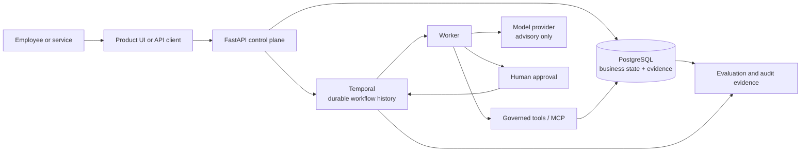

# Agents Should Survive Failure

**A production-style reference implementation for reliable, governed AI workflows.**

It demonstrates how an AI-assisted business process can survive worker crashes, retries, delayed approvals, duplicate delivery, and uncertain network outcomes without losing its state or repeating consequential business actions.

[](https://github.com/kabbersokhi-boop/agents-should-survive-failure/actions/workflows/ci.yml) [](https://github.com/kabbersokhi-boop/agents-should-survive-failure/releases/latest) [](https://www.python.org/downloads/release/python-3120/) [](LICENSE)

## What this project actually is

This is not a chatbot and it is not a vendor-management product.

It is a reference backend for teams building AI agents that participate in important, multi-step business operations. Those operations may involve external tools, human approval, long waits, retries, and actions that must not happen twice.

Examples of the broader pattern include:

- investigating an operational incident before taking a corrective action;
- reviewing a large refund before issuing it;
- collecting evidence for an insurance or compliance case;
- preparing an account change that requires approval;
- coordinating an internal IT operation across multiple systems.

This repository does **not** implement all of those products. It implements one complete reference workflow and the reusable reliability patterns around it.

## Who would use it?

The direct users are AI engineers, backend engineers, and platform teams turning an agent prototype into a dependable business workflow.

A normal employee would usually interact with a simpler application built on top of this platform—for example, an approval screen showing the evidence collected by an agent. Engineers would use the API, workflow history, database evidence, and operational dashboards behind that screen.

The project focuses on questions that appear after an AI demo starts becoming a real system:

- What happens if the worker crashes after an action succeeds?
- What happens if the same request or approval arrives twice?
- How does a workflow wait safely for a person?
- Which tools is an agent allowed to call?
- Who is authorized to approve a consequential action?
- How can an operator prove what happened later?

## Why vendor onboarding?

Vendor onboarding is the **reference scenario**, not the general product.

It was chosen because it contains the right ingredients for proving the platform:

1. A company receives a request to work with a new supplier.
2. The system retrieves vendor and policy evidence.
3. Deterministic code calculates a risk score.
4. A model explains that bounded evidence in plain language.
5. The workflow pauses and waits for an authorized approval.
6. If approved, the system records the approved vendor and creates a synthetic email.
7. Every important step is persisted as business and audit evidence.

The same reliability pattern can be adapted to other consequential workflows. Vendor onboarding is simply the tested vehicle used to make the failure cases concrete.

## The key product boundary

The model may interpret evidence and request governed tools. It cannot approve its own recommendation or directly perform unrestricted business writes.

- **Models interpret.**
- **Deterministic code enforces rules.**
- **Authenticated principals authorize consequential decisions.**
- **Governed activities and tools perform effects.**

That separation is central to the project.

## What happens during a failure?

Imagine that an approved action commits to PostgreSQL, but the worker crashes before Temporal receives the completion acknowledgement.

Temporal honestly assumes the activity may need to run again. A replacement worker receives the task. Stable idempotency keys, transactions, and database uniqueness constraints then make the repeated delivery converge on the business effect that already exists.

The correct claim is:

> Execution may occur more than once, while the business effect is committed once.

## How the system is divided

| Component | Responsibility | Plain-English analogy |
| --- | --- | --- |
| Temporal | Workflow history, retries, timers, updates, durable waits, and recovery | A case manager that remembers every completed step |
| PostgreSQL | Business state, approval records, audit evidence, and idempotency | The company’s official record book |
| Worker | Performs the next workflow activity | The employee or machine currently doing the work |
| Tool gateway | Checks identity, run grants, versions, schemas, approval, and idempotency | A security desk for every requested action |
| Idempotency key | Identifies one intended effect across retries | A receipt number that prevents duplicate processing |
| Model provider | Produces bounded explanations | An adviser, not the decision-maker |

## Architecture



Temporal owns orchestration. PostgreSQL owns business truth and evidence. Models explain but do not authorize. Consequential effects pass through governed activities and tools.

## What you can see in a demonstration

There is no custom customer-facing dashboard in this reference repository. A local demonstration uses existing engineering interfaces:

- **FastAPI/OpenAPI** at `http://127.0.0.1:8000/docs` to create and approve cases;
- **Temporal UI** at `http://127.0.0.1:8080` to show workflow history and the durable approval wait;
- **Grafana** at `http://127.0.0.1:3000` to show operational health and workflow metrics;
- **the terminal** to run the real worker-crash proof;
- **the evidence API or PostgreSQL** to show that only one business effect exists.

A strong seven-minute demo is:

1. Start the stack and submit a synthetic vendor.
2. Open Temporal UI and show the workflow waiting for approval.
3. Explain that the model produced evidence but cannot approve the case.
4. Approve the request through the authenticated API.
5. Show the completed workflow and persisted evidence.
6. Run `make test-worker-crash`.
7. Show that a replacement worker completes the redelivered activity with exactly one approval, one approved-vendor projection, and one synthetic email.

See the [full demonstration guide](docs/demo.md) for a screen-by-screen script.

## Two ways to use this repository

### 1. Run and study the proven reference workflow

The mature path is vendor onboarding. Use it to understand durable workflow execution, recoverable starts, approvals, governed tools, duplicate-safe effects, evaluation, and observability.

You do not need the SDK to run this path.

### 2. Build a compatible external Python agent

The separate SDK is a **preview developer contract** for trusted, operator-installed Python agents.

An agent declares its metadata, task and result shapes, required tools, and capabilities. The platform then supplies a constrained runtime context for actions such as:

- calling a governed tool;
- saving a checkpoint;
- creating an artifact;
- requesting human approval;
- checking cancellation;
- emitting progress events.

The SDK is not an automatic adapter for any existing agent, an n8n connector, or a hosted upload service. Existing agent code must be adapted to the SDK contract, packaged, installed in the trusted worker environment, registered, and started through the API.

The independently packaged Operations Investigation Agent demonstrates that path. The SDK/runtime remains preview quality and delegation remains experimental.

## What was proven in `v0.2.0`

| Evidence | Result |
| --- | --- |
| Production-workflow evaluation | 24/24 reviewed cases passed |
| Runtime | Real Temporal and PostgreSQL execution |
| Crash recovery | OS-level Docker worker kill with `SIGKILL`, replacement-worker recovery |
| Business effects | Exactly one approval decision, approved-vendor projection, and synthetic email |
| Automated tests | 169 unit tests, 21 integration tests, 7 dedicated security tests |
| Database lifecycle | Migration upgrade, downgrade, and re-upgrade; head `b5c6d7e8f9a0` |
| Supply-chain checks | Gitleaks, dependency audit, backend, SDK, and container SBOMs |
| External package proof | Real execution of the separately packaged Operations Investigation Agent |

See the [committed `v0.2.0` evidence summary](docs/evidence/v0.2.0.md), the [GitHub release](https://github.com/kabbersokhi-boop/agents-should-survive-failure/releases/tag/v0.2.0), and [successful GitHub Actions run 29545587083](https://github.com/kabbersokhi-boop/agents-should-survive-failure/actions/runs/29545587083).

## Run the project

Prerequisites: Python 3.12, [uv](https://docs.astral.sh/uv/), Docker, and Docker Compose.

```bash
git clone https://github.com/kabbersokhi-boop/agents-should-survive-failure.git
cd agents-should-survive-failure
uv python install 3.12
uv sync --frozen --all-groups
make up
curl http://127.0.0.1:8000/health/ready
```

The [local-development runbook](docs/runbooks/local-development.md) covers API-key setup, authenticated calls, database operations, and the local service interfaces.

## Run the strongest proofs

```bash
make validate-evaluation-dataset
make test-worker-crash
make test-managed-agent
make test-integration
```

`make test-integration` builds and runs an isolated Docker Compose project, exercises migration lifecycle checks and the real workflow evaluator, exports bounded evidence, and removes its containers and volumes.

## Maturity map

| Surface | Status | What can be claimed |
| --- | --- | --- |
| Vendor-onboarding workflow | Mature reference workflow | Release-proven durable approval, recovery, and duplicate-safe effects |
| Recoverable workflow starts | Mature reference mechanism | Ambiguous Temporal starts can be reconciled without starting duplicates |
| Governed tools and MCP boundary | Mature reference mechanism | Run-scoped grants, version pinning, schema checks, approval, idempotency, and evidence |
| Public SDK and managed-agent runtime | Preview | A trusted installed Python agent can run through a constrained context |
| Delegation | Experimental | Code exists, but it is not release-proven as a complete production feature |
| Hostile-code isolation | Not provided | Docker is not represented as a complete security boundary |

## Repository guide

| Path | Contents |
| --- | --- |
| `src/agents_should_survive_failure/` | FastAPI control plane, workflows, persistence, policy, tools, and evaluation |
| `packages/agents-should-survive-failure-sdk/` | Standalone public SDK preview |
| `packages/example-operations-agent/` | Independently packaged external-agent example |
| `migrations/` | PostgreSQL schema history |
| `scripts/` | Compose, crash-recovery, SDK, and managed-agent proofs |
| `tests/` | Unit, integration, and security tests |
| `deployment/` | PostgreSQL, Temporal, Prometheus, Tempo, and Grafana configuration |
| `docs/` | Plain-English guide, architecture, runbooks, evidence, security, and limitations |

## Scope and limitations

This is a production-style reference implementation, not a production-ready hosted platform or compliance product.

- Vendor onboarding is the mature reference workflow.
- The managed-agent SDK/runtime is preview quality.
- Delegation is experimental and not release-proven.
- External packages are trusted, operator-installed code.
- Docker is not hostile-code isolation.
- NVIDIA NIM live checks require credentials and are not part of public CI.
- The repository does not claim multi-tenancy, high availability, enterprise identity, billing, Kubernetes operation, or production compliance controls.

Read the [plain-English guide](docs/plain-english-guide.md), [full limitations](docs/limitations.md), and [threat model](docs/threat-model.md) before adapting the design.

## Documentation

Start with:

1. [Plain-English guide: who uses this and why](docs/plain-english-guide.md)
2. [Five-to-ten-minute demonstration guide](docs/demo.md)
3. [Local development runbook](docs/runbooks/local-development.md)
4. [System boundaries and architecture decisions](docs/adr/0001-system-boundaries.md)
5. [`v0.2.0` release evidence](docs/evidence/v0.2.0.md)

The complete [documentation index](docs/README.md) links to evaluation, security, SDK, operational, and historical material.

## License

Licensed under the Apache License 2.0. See [LICENSE](LICENSE).
