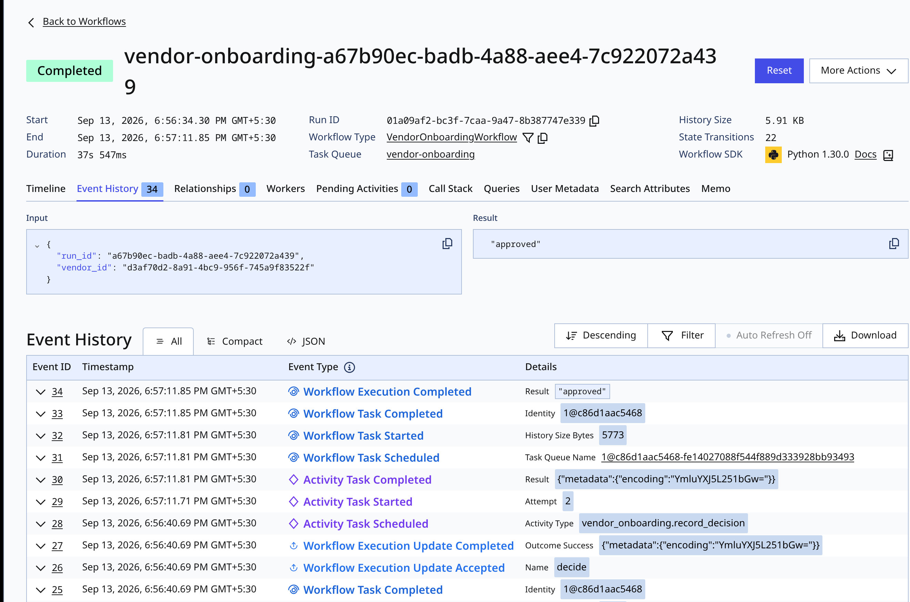
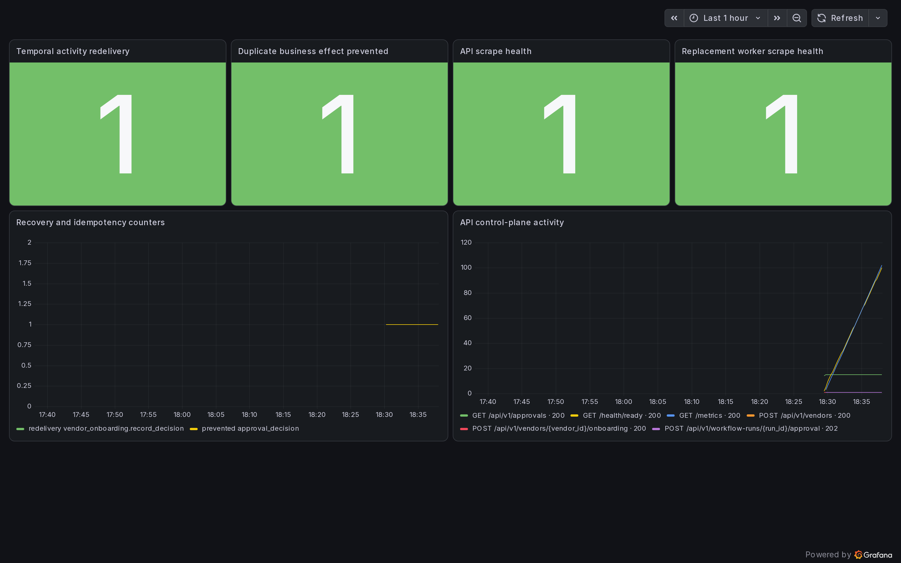
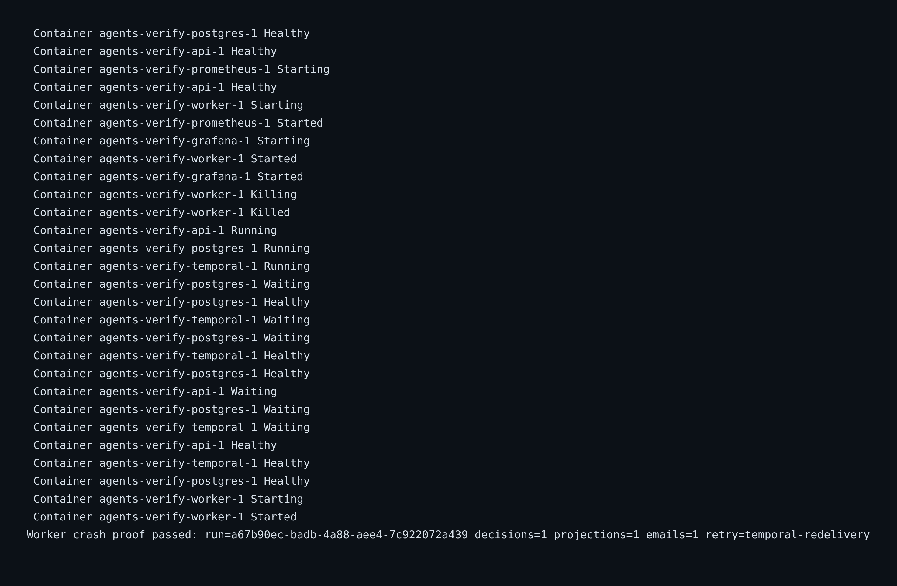
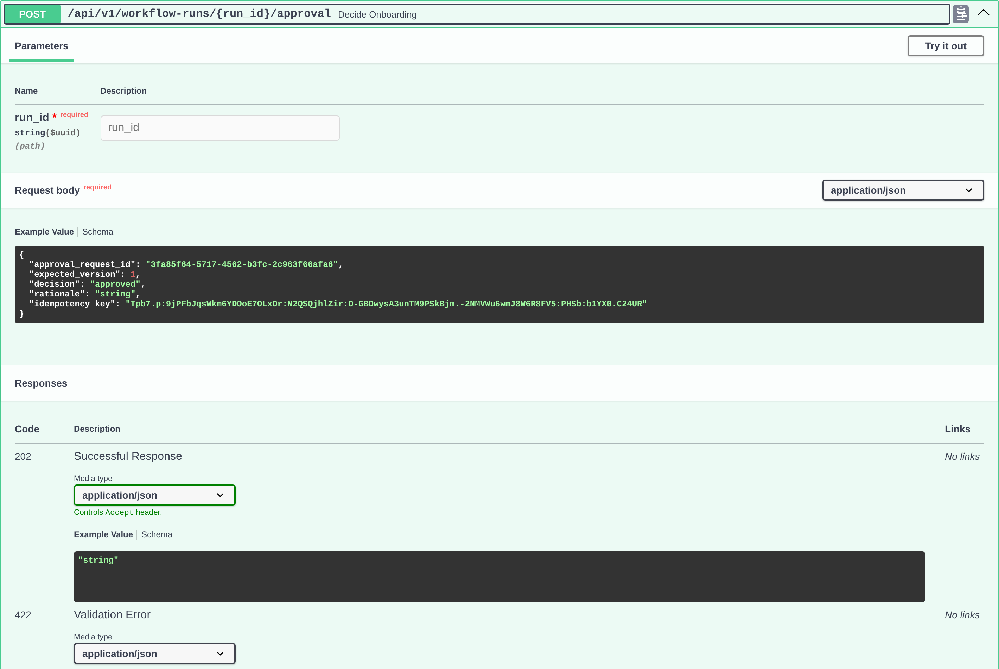

# Earlier crash-recovery evidence

These retained screenshots document a separate execution of the reference
crash proof. For the current operator-console journey, use the
[end-to-end video and case-scoped evidence](../../portfolio-demo.md).

## Durable recovery

Temporal redelivers the decision activity after worker termination and completes
the workflow.

## Operational context

Grafana shows aggregate recovery, duplicate-prevention and worker-health signals.
These counters do not replace case-scoped database assertions.

## Executable assertions

The executable proof checks one approval decision, one vendor projection and
one locally stored synthetic email after worker replacement and redelivery.

## Human authority

The versioned approval contract makes an explicit authenticated decision the
authoritative workflow input.

These are tested local business-effect guarantees under at-least-once execution,
not a claim of exactly-once distributed execution.
